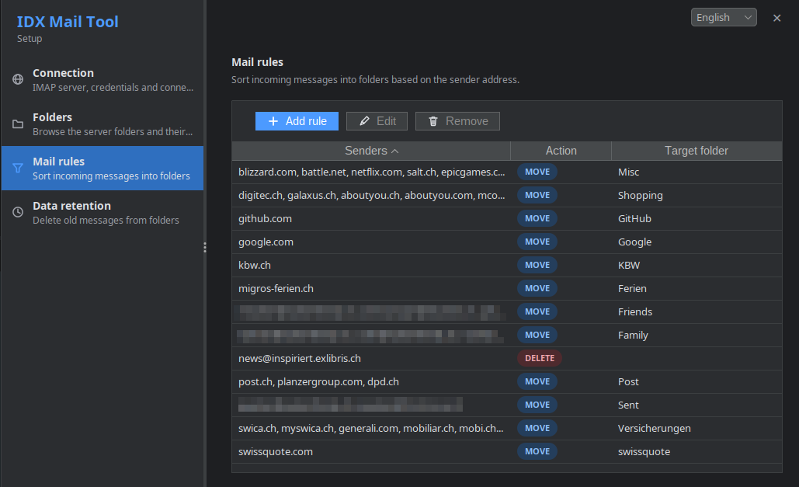

# Idx Mail Tool

A small, self-contained tool for organising IMAP mailboxes: define mail-sorting rules and folder retention
policies in a local configuration, then apply them to your account.



## Features

- **Setup UI** — a dark-themed Swing interface (English, German, French, Italian) to configure the connection,
  rules and retention policies.
- **Mail rules** — move, copy or delete incoming messages based on the sender.
- **Retention policies** — delete messages from a folder after a configurable period.
- **Folders overview** — message counts, retention and the rules targeting each folder.
- **Apply** — run all configured rules and retention policies against the mailbox.

## Requirements

Java 17 or newer.

## Build

```bash
mvn
```

Creates the executable, self-contained JAR at `target/idx-mail-tool.jar`.

## Usage

```bash
java -jar target/idx-mail-tool.jar [command]
```

| Command | Description                                                    |
|---------|----------------------------------------------------------------|
| `gui`   | Open the GUI (default when no command is given)                |
| `setup` | Open the GUI in the connection setup section                   |
| `apply` | Apply all rules and retention policies                         |

When no configuration exists yet, or the configured account has no connection settings, the GUI opens on the
setup section automatically. Running with an unknown command prints the usage information.

## Configuration

The configuration is stored in `~/.idx-mail-tool.yaml` and is normally maintained through the setup UI. It maps
account names to connection settings, mail rules and retention policies:

```yaml
accounts:
  default:
    host: mail.example.org
    port: 993
    tls-enabled: true
    username: user@example.org
    password: secret
    rules:
      - senders: insurance.com, bank.com
        action: MOVE
        folder: Finance
      - senders: newsletter@example.com
        action: DELETE
    data-retention:
      - folder: Spam
        retention-period: 21d
```

- `rules.[*].action` is `MOVE`, `COPY` or `DELETE`.
- `rules.[*].folder` is the target folder (case-insensitive partial name).
- `data-retention.[*].retention-period` is a duration such as `90d` or `1d 12h`.

## License

See [LICENSE](LICENSE).
